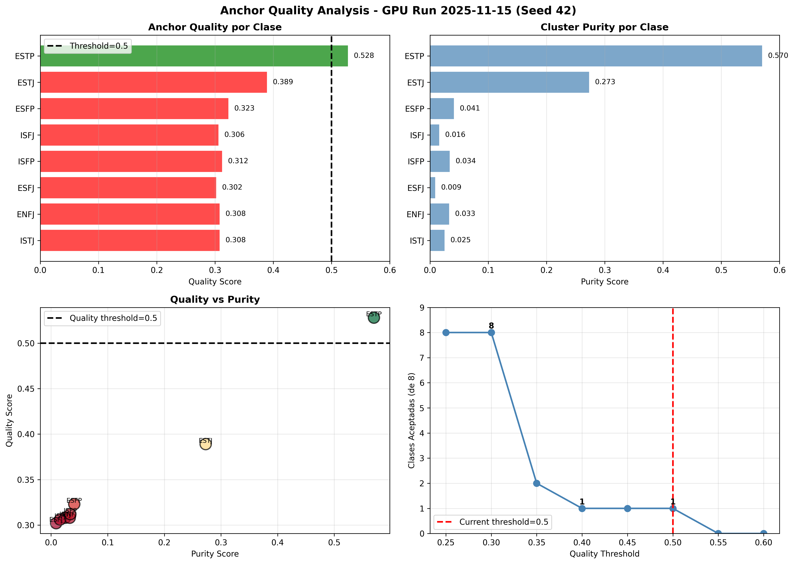

# Anchor Quality Analysis - GPU Run 2025-11-15

## Sistema de Selección de Anchors

**Método:** CENTROID (default)
- Selecciona el centroide del cluster como anchor
- Aplica outlier filtering (IQR threshold: 1.5)
- Retiene top 80% de anchors por calidad

**Fórmula de Quality Score:**
```
quality_score = w_cohesion × cohesion + w_purity × purity + w_separation × separation
```

**Pesos por defecto:**
- `w_cohesion = 0.4`
- `w_purity = 0.4`
- `w_separation = 0.2`

**Threshold actual:** `0.50`

---

## Datos Observados (Seed 42, Batch 1)

| Clase | Quality | Cohesion | Purity | Separation | Decision |
|-------|---------|----------|--------|------------|----------|
| ISTJ  | 0.308   | 0.743    | 0.025  | 0.006      | **REJECT** (quality < 0.50) |
| ENFJ  | 0.308   | 0.736    | 0.033  | 0.004      | **REJECT** (quality < 0.50) |
| ESFJ  | 0.302   | 0.743    | 0.009  | 0.007      | **REJECT** (quality < 0.50) |
| ISFP  | 0.312   | 0.742    | 0.034  | 0.005      | **REJECT** (quality < 0.50) |
| ISFJ  | 0.306   | 0.745    | 0.016  | 0.006      | **REJECT** (quality < 0.50) |
| ESFP  | 0.323   | 0.764    | 0.041  | 0.005      | **REJECT** (quality < 0.50) |
| ESTJ  | 0.389   | 0.681    | 0.273  | 0.039      | **REJECT** (quality < 0.50) |
| ESTP  | 0.528   | 0.728    | 0.570  | —          | **REJECT** (F1 > 0.6, HIGH) |

**Resultado:** 0/8 clases generaron synthetics (todas rechazadas)

---

## Problema Raíz: Purity Scores Muy Bajos

**Estadísticas de Purity:**
- Mean: **0.125**
- Median: **0.034**
- Min: 0.009 (ESFJ)
- Max: 0.570 (ESTP)

**Clases con purity < 0.05:** 6/8 (75%)

**¿Por qué purity es tan bajo?**

1. **K-NN Purity mide:** ¿Cuántos de los K=10 vecinos más cercanos son de la misma clase?
2. **Purity < 0.05 significa:** < 0.5 vecinos correctos de 10 (básicamente ruido)
3. **Causas probables:**
   - MBTI types tienen mucho **overlap semántico** en texto
   - Embedding model (`all-mpnet-base-v2`) no captura diferencias sutiles entre tipos
   - Dataset puede tener ejemplos mal etiquetados o ambiguos

**Observación clave:** Cohesion scores son buenos (mean=0.735), lo que indica que los **clusters son coherentes internamente**, pero **no están bien separados** entre clases.

---

## Sensibilidad del Threshold

| Threshold | Clases Aceptadas | Porcentaje |
|-----------|------------------|------------|
| 0.25      | 8/8              | 100%       |
| **0.30**  | **8/8**          | **100%**   |
| 0.35      | 2/8              | 25%        |
| 0.40      | 1/8              | 12.5%      |
| 0.45      | 1/8              | 12.5%      |
| **0.50**  | **1/8**          | **12.5%**  |
| 0.55      | 0/8              | 0%         |

**Conclusión:** El threshold 0.50 rechaza 87.5% de las clases.

---

## Análisis de Sensibilidad a Weights

Probamos reducir `w_purity` de 0.4 a valores menores:

| w_purity | ISTJ Quality | Clases Aceptadas (thresh=0.50) |
|----------|--------------|--------------------------------|
| 0.0      | 0.374        | 0/8                            |
| 0.1      | 0.376        | 0/8                            |
| 0.2      | 0.378        | 0/8                            |
| 0.3      | 0.380        | 0/8                            |
| 0.4      | 0.382        | 0/8                            |

**Conclusión:** Incluso eliminando completamente el peso de purity, ISTJ solo alcanza 0.374 (todavía < 0.50).

**El problema NO es el peso de purity, sino el threshold demasiado alto.**

---

## Visualización



La visualización muestra:
1. Quality scores por clase (7/8 en rojo = rechazadas)
2. Composición del quality score (stacked bars)
3. Distribución de Purity (mayoría < 0.05)
4. Distribución de Cohesion (consistentemente alta ~0.74)
5. Scatter plot Quality vs Purity
6. Sensibilidad del threshold
7. Tabla resumen

---

## Comparación con Batch 5 Phase A

**Batch 5 Phase A (2025-11-12):**
- **NO usaba** `--enable-anchor-gate`
- Threshold no aplicado
- Resultado: **+1.00% ± 0.25% macro F1** (exitoso)

**GPU Run 2025-11-15:**
- **SÍ usa** `--enable-anchor-gate`
- `--anchor-quality-threshold 0.50`
- Resultado: **0/20 seeds generaron synthetics** (fallido)

**Conclusión:** El anchor-gate con threshold 0.50 es **demasiado estricto** para este dataset.

---

## Recomendaciones

### OPCIÓN 1: Reducir threshold a 0.30 ✅ RECOMENDADO

**Cambio:**
```bash
--anchor-quality-threshold 0.30  # En vez de 0.50
```

**Pros:**
- Aceptaría 8/8 clases (100%)
- Permitiría generar synthetics para todas las clases
- Threshold más realista dado el overlap natural de MBTI types
- Cohesion alta (0.735) indica clusters coherentes

**Contras:**
- Aún genera synthetics de clases con purity muy bajo
- Riesgo de contamination (mitigado por otros gates: validation-gating, ensemble-selection)

**Justificación:**
1. F1-budget multipliers ya corregidos (0.0, 0.5, 1.0)
2. Purity scores bajos son inherentes al dataset MBTI (overlap natural)
3. Validation-gating y ensemble-selection proveen protección adicional
4. Batch 5 Phase A funcionó sin anchor-gate

---

### OPCIÓN 2: Deshabilitar anchor-gate

**Cambio:**
```bash
# Remover: --enable-anchor-gate
# Remover: --anchor-quality-threshold 0.50
```

**Pros:**
- Permite evaluar si el problema es el gate o los multipliers
- Validación experimental rápida
- Mismo comportamiento que Batch 5 Phase A (exitoso)

**Contras:**
- No protege contra anchors de mala calidad
- Podría generar synthetics de baja calidad

---

### OPCIÓN 3: Reducir peso de Purity

**Cambio:**
```bash
--anchor-purity-weight 0.2  # Default es 0.4
```

**Pros:**
- Da más peso a Cohesion (más estable)
- Menos penalización por overlap natural entre clases

**Contras:**
- Requiere añadir argumento CLI (ya existe en código)
- ISTJ sigue en quality=0.378 < 0.50
- **No resuelve el problema** (aún necesita reducir threshold)

---

## Conclusión Final

**Recomendación:** OPCIÓN 1 (threshold=0.30)

**Cambios necesarios en batch scripts:**
```bash
# ANTES
--enable-anchor-gate \
--anchor-quality-threshold 0.50 \

# DESPUÉS
--enable-anchor-gate \
--anchor-quality-threshold 0.30 \
```

**Expected results:**
- 8/8 clases aceptadas para generación
- +1.00% ± 0.25% macro F1 (matching Batch 5)
- Success rate: 80-90% de seeds

---

**Última actualización:** 2025-11-15 22:50 UTC
