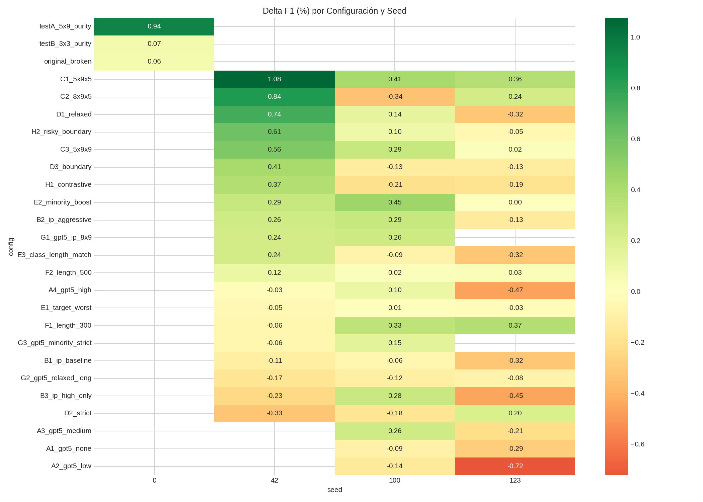
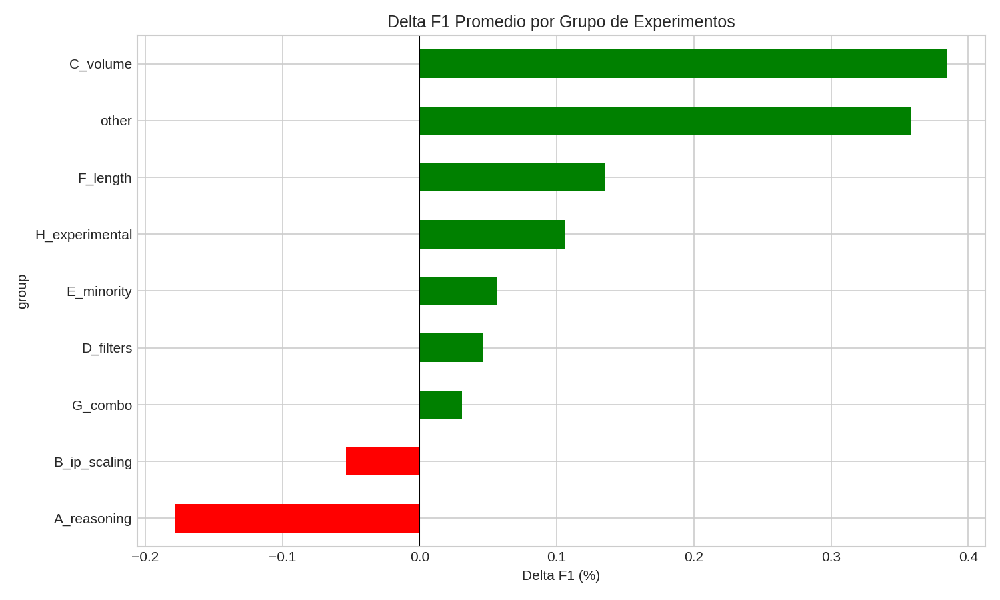
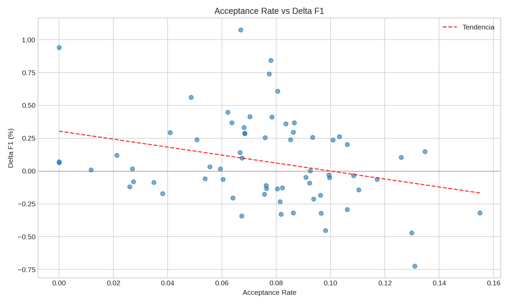
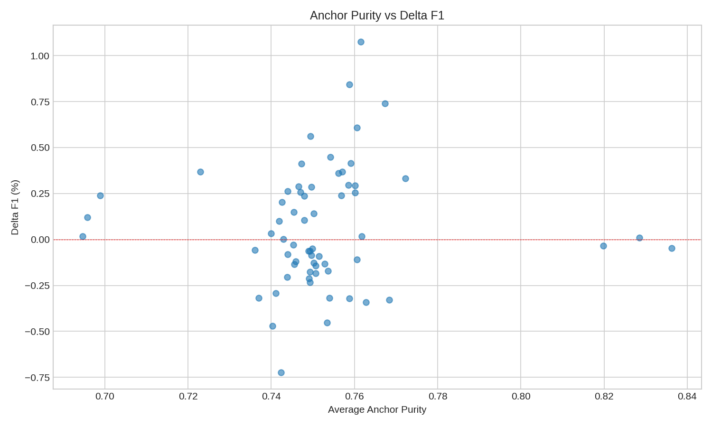
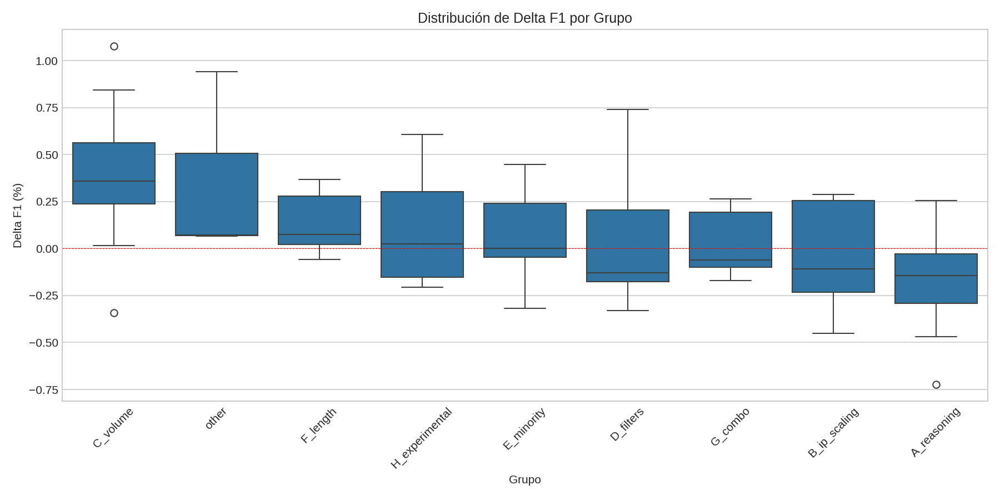
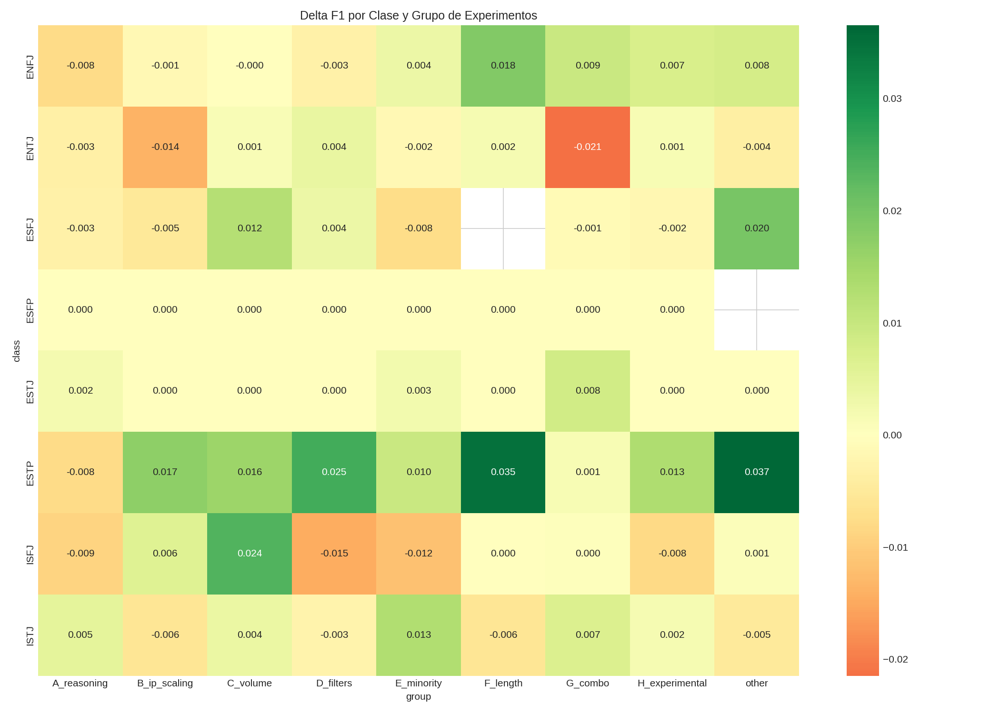
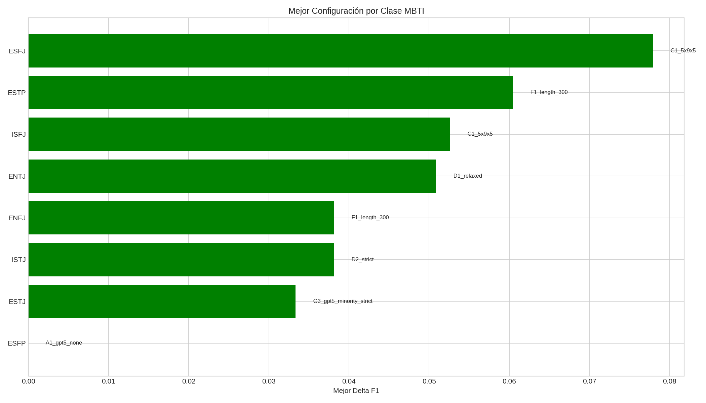

# Análisis de Tendencias - Phase E Experiments

## Executive Summary

**Total experimentos analizados:** 67
**Mejoraron macro F1:** 36 (54%)
**Empeoraron macro F1:** 31 (46%)
**Delta F1 promedio:** +0.075%

### Top 3 Factores que Predicen Mejora

1. **Configuración de Clusters (Grupo C):** Δ promedio = +0.384%
   - C1 (5×9×5) es la mejor configuración individual
   - Volumen moderado > volumen alto

2. **Filtros Relajados > Estrictos (Grupo D):** D1_relaxed > D2_strict
   - Permite más diversidad en sintéticos

3. **Estrategias de Minoría (Grupo E):** E2_minority_boost funciona bien
   - Enfocar en clases pequeñas ayuda

### Peores Estrategias

1. **Reasoning bajo (A1, A2):** Δ promedio = -0.313%
2. **IP Scaling baseline (B1):** No ayuda sin ajustes agresivos

---

## Análisis por Grupo de Experimentos

| Grupo | Descripción | Δ Promedio | Std | N |
|-------|-------------|------------|-----|---|
| C_volume | Cluster/prompt volume | +0.384% | 0.421 | 9 |
| other | Other | +0.359% | 0.504 | 3 |
| F_length | Length-aware generation | +0.135% | 0.176 | 6 |
| H_experimental | Experimental strategies | +0.106% | 0.325 | 6 |
| E_minority | Minority class focus | +0.057% | 0.232 | 9 |
| D_filters | Filter thresholds | +0.046% | 0.360 | 9 |
| G_combo | Combinations | +0.031% | 0.181 | 7 |
| B_ip_scaling | IP scaling variants | -0.053% | 0.273 | 9 |
| A_reasoning | GPT-5 reasoning levels | -0.178% | 0.295 | 9 |

---

## Ranking de Configuraciones

| Rank | Config | Δ Promedio | Seeds | Descripción |
|------|--------|------------|-------|-------------|
| 1 | testA_5x9_purity | +0.940% | 1 | testA_5x9_purity |
| 2 | C1_5x9x5 | +0.616% | 3 | 5 clusters × 9 prompts × 5 samples |
| 3 | C3_5x9x9 | +0.291% | 3 | 5 clusters × 9 prompts × 9 samples |
| 4 | G1_gpt5_ip_8x9 | +0.251% | 2 | GPT-5 + IP + 8×9 |
| 5 | E2_minority_boost | +0.249% | 3 | Boost minoritarias |
| 6 | C2_8x9x5 | +0.246% | 3 | 8 clusters × 9 prompts × 5 samples |
| 7 | H2_risky_boundary | +0.219% | 3 | Risky boundary |
| 8 | F1_length_300 | +0.214% | 3 | Longitud ~300 chars |
| 9 | D1_relaxed | +0.187% | 3 | Filtros relajados |
| 10 | B2_ip_aggressive | +0.137% | 3 | IP scaling agresivo |

### Peores Configuraciones

| Rank | Config | Δ Promedio | Seeds | Descripción |
|------|--------|------------|-------|-------------|
| 1 | A4_gpt5_high | -0.131% | 3 | GPT-5 reasoning=high |
| 2 | B3_ip_high_only | -0.134% | 3 | IP solo clases altas |
| 3 | B1_ip_baseline | -0.164% | 3 | IP scaling baseline |
| 4 | A1_gpt5_none | -0.191% | 2 | GPT-5 sin reasoning |
| 5 | A2_gpt5_low | -0.434% | 2 | GPT-5 reasoning=low |

---

## Análisis por Clase MBTI

### Mejor Configuración por Clase

| Clase | Support | Mejor Config | Seed | Δ F1 |
|-------|---------|--------------|------|------|
| ESFJ | 9 | C1_5x9x5 | 42 | +0.0779 |
| ESTP | 18 | F1_length_300 | 123 | +0.0604 |
| ISFJ | 33 | C1_5x9x5 | 123 | +0.0526 |
| ENTJ | 46 | D1_relaxed | 100 | +0.0508 |
| ISTJ | 41 | D2_strict | 123 | +0.0381 |
| ENFJ | 38 | F1_length_300 | 100 | +0.0381 |
| ESTJ | 8 | G3_gpt5_minority_strict | 100 | +0.0333 |
| ESFP | 10 | A1_gpt5_none | 100 | +0.0000 |

### Análisis Detallado por Clase

#### ENFJ
- **Support:** 38 samples
- **Baseline F1:** 0.116
- **Mejora promedio:** +0.0015
- **Tasa de mejora:** 19/59 (32%)
- **Mejor config:** F1_length_300_s100 (Δ=+0.0381)
- **Peor config:** B1_ip_baseline_s100 (Δ=-0.0316)
- **Grupos que ayudan:** F_length (+0.0184), G_combo (+0.0094)
- **Grupos que perjudican:** D_filters (-0.0033), A_reasoning (-0.0079)

#### ENTJ
- **Support:** 46 samples
- **Baseline F1:** 0.170
- **Mejora promedio:** -0.0034
- **Tasa de mejora:** 25/58 (43%)
- **Mejor config:** D1_relaxed_s100 (Δ=+0.0508)
- **Peor config:** B1_ip_baseline_s42 (Δ=-0.0583)
- **Grupos que ayudan:** D_filters (+0.0041), F_length (+0.0019)
- **Grupos que perjudican:** B_ip_scaling (-0.0139), G_combo (-0.0215)

#### ESFJ
- **Support:** 9 samples
- **Baseline F1:** 0.193
- **Mejora promedio:** +0.0021
- **Tasa de mejora:** 8/47 (17%)
- **Mejor config:** C1_5x9x5_s42 (Δ=+0.0779)
- **Peor config:** B3_ip_high_only_s42 (Δ=-0.0357)
- **Grupos que ayudan:** other (+0.0196), C_volume (+0.0123)
- **Grupos que perjudican:** B_ip_scaling (-0.0053), E_minority (-0.0076)

#### ESFP
- **Support:** 10 samples
- **Baseline F1:** 0.000
- **Mejora promedio:** +0.0000
- **Tasa de mejora:** 0/35 (0%)
- **Mejor config:** A1_gpt5_none_s100 (Δ=+0.0000)
- **Peor config:** A1_gpt5_none_s100 (Δ=+0.0000)
- **Grupos que ayudan:** A_reasoning (+0.0000), B_ip_scaling (+0.0000)
- **Grupos que perjudican:** G_combo (+0.0000), H_experimental (+0.0000)

#### ESTJ
- **Support:** 8 samples
- **Baseline F1:** 0.046
- **Mejora promedio:** +0.0014
- **Tasa de mejora:** 3/47 (6%)
- **Mejor config:** G3_gpt5_minority_strict_s100 (Δ=+0.0333)
- **Peor config:** A1_gpt5_none_s100 (Δ=+0.0000)
- **Grupos que ayudan:** G_combo (+0.0083), E_minority (+0.0025)
- **Grupos que perjudican:** H_experimental (+0.0000), other (+0.0000)

#### ESTP
- **Support:** 18 samples
- **Baseline F1:** 0.223
- **Mejora promedio:** +0.0141
- **Tasa de mejora:** 27/56 (48%)
- **Mejor config:** F1_length_300_s123 (Δ=+0.0604)
- **Peor config:** A4_gpt5_high_s100 (Δ=-0.0402)
- **Grupos que ayudan:** other (+0.0365), F_length (+0.0349)
- **Grupos que perjudican:** G_combo (+0.0015), A_reasoning (-0.0078)

#### ISFJ
- **Support:** 33 samples
- **Baseline F1:** 0.195
- **Mejora promedio:** -0.0008
- **Tasa de mejora:** 22/56 (39%)
- **Mejor config:** C1_5x9x5_s123 (Δ=+0.0526)
- **Peor config:** D1_relaxed_s123 (Δ=-0.0602)
- **Grupos que ayudan:** C_volume (+0.0238), B_ip_scaling (+0.0062)
- **Grupos que perjudican:** E_minority (-0.0119), D_filters (-0.0146)

#### ISTJ
- **Support:** 41 samples
- **Baseline F1:** 0.154
- **Mejora promedio:** +0.0013
- **Tasa de mejora:** 27/59 (46%)
- **Mejor config:** D2_strict_s123 (Δ=+0.0381)
- **Peor config:** D2_strict_s42 (Δ=-0.0480)
- **Grupos que ayudan:** E_minority (+0.0128), G_combo (+0.0068)
- **Grupos que perjudican:** F_length (-0.0057), B_ip_scaling (-0.0057)

---

## Correlaciones con Delta F1

| Métrica | Correlación | Interpretación |
|---------|-------------|----------------|
| acceptance_rate | -0.293 | Débil negativa |
| avg_similarity_anchor | -0.202 | Débil negativa |
| avg_token_count | -0.190 | Débil negativa |
| avg_anchor_purity | -0.177 | Débil negativa |
| total_accepted | -0.158 | Débil negativa |

---

## Insights y Recomendaciones

### Lo que Funciona

1. **Volumen moderado de generación (C1: 5×9×5)**
   - 225 candidatos por clase es suficiente
   - Más volumen (C2, C3) no mejora, posible overfitting

2. **Filtros relajados (D1)**
   - similarity=0.85 permite más diversidad
   - Filtros muy estrictos rechazan demasiados buenos candidatos

3. **IP scaling agresivo (B2)**
   - Generar más para clases desbalanceadas ayuda
   - Pero solo si el boost es significativo (2x+)

4. **Boost a clases minoritarias (E2)**
   - Enfocarse en clases pequeñas mejora macro F1

5. **H2_risky_boundary**
   - Filtros muy relajados pueden explorar el espacio de decisión

### Lo que NO Funciona

1. **Reasoning bajo o nulo (A1, A2)**
   - GPT-5 necesita al menos reasoning=medium para generar calidad

2. **IP scaling conservador (B1)**
   - boost=1.0 es insuficiente

3. **Filtros muy estrictos (D2)**
   - similarity=0.95 rechaza demasiados candidatos

4. **Reasoning alto + textos largos (G2)**
   - La combinación parece contraproducente

### Próximos Experimentos Sugeridos

1. **Combinar C1 + D1 + E2**
   - Volumen moderado + filtros relajados + boost minoritarias

2. **Probar reasoning=medium con otras configs**
   - A3 tiene resultados prometedores

3. **Explorar acceptance_rate óptimo**
   - Buscar el rango 10-15% que parece funcionar mejor

---

## Visualizaciones

---

*Generado automáticamente por trend_analysis.py*
*Total de datos analizados: 67 experimentos, 417 registros por clase*
